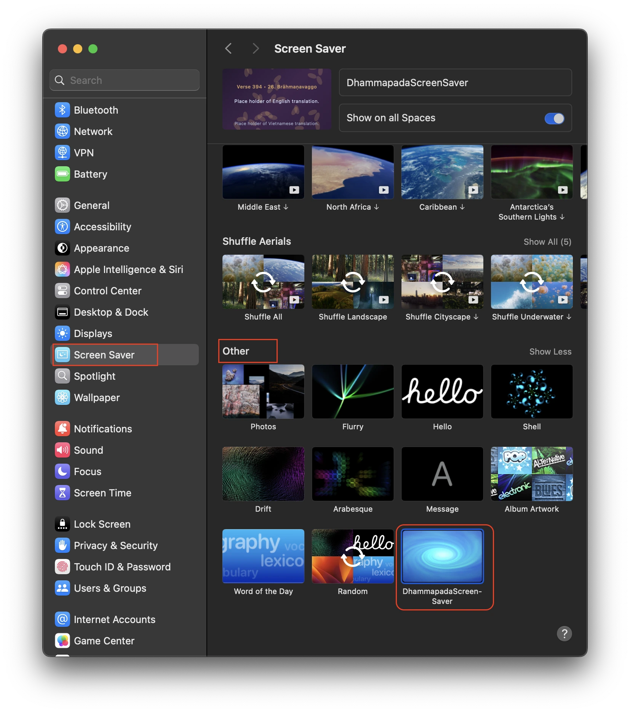

# macOS Dhammapada ScreenSaver

A macOS screensaver that quietly displays verses from the Dhammapada.

Showing Pāḷi, English, and Vietnamese (and more?).


## Installation

1.  **Build the screensaver:**
    *   Open the project `Xcode` in Xcode.
    *   Select `Product → Build`.
2.  **Locate the `.saver` file:**
    *   After a successful build, select `Product → Show Build Folder in Finder`.
    *   Navigate to the `Products/Debug` folder to find the `DhammapadaScreenSaver.saver` file.
3.  **Install:**
    *   Double-click the `DhammapadaScreenSaver.saver` file to install it.
    *   Open `System Settings → Screen Saver`, select "DhammapadaScreenSaver", and set it as your screensaver.



## Development

These instructions are for developers who want to modify the source code or update the Dhammapadapāḷi text.


### Preparing the Dhammapada Text


The `PrepareText` directory contains scripts to convert the Dhammapadapāḷi text into an Objective-C dictionary.

**Prerequisites:**

*   Python 3
*   A plain text file containing the Dhammapada verses. For this project, the text was sourced from [Tipitaka Pali Org/VRI edition](https://tipitakapali.org/book/s0502m.mul). Save your text as `dhammapada_copy_html.txt` in the `PrepareText` directory.

**Steps:**

1.  **Parse Text to JSON:**
    This script converts the plain text into a structured JSON file.

    ```bash
    cd PrepareText
    python3 parse_text_to_json.py dhammapada_copy_html.txt dhammapada.json
    ```

2.  **Convert JSON to Objective-C Dictionary:**
    This script converts the JSON file into an Objective-C dictionary format.

    ```bash
    python3 parse_json_to_dictm.py dhammapada.json VerseDatabase.m
    ```

3.  **Update the Source Code:**
    Copy the generated `VerseDatabase.m` into `Xcode/DhammapadaScreenSaver/VerseDatabase.m`.


### Credits:

99.99% of the code in this project is generated by AI (Claude, GPT-5 mini). This README.md is generated with Gemini 2.5 pro in VS Code Copilot.
